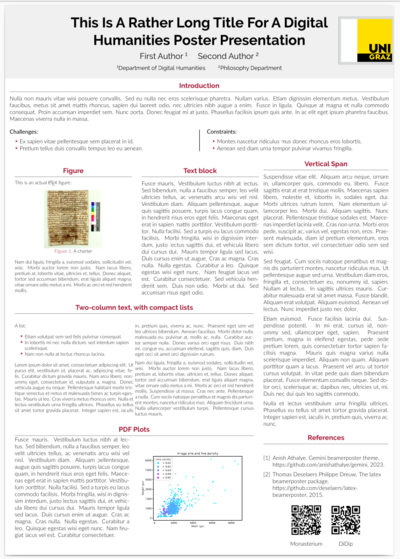

# A template for UniGraz-DH poster

This template is based on the `beamerposter` class written by Philippe Dreuw and Thomas Deselaers.


## How to use

In the Linux shell

1. Verify that
   + the `beamer` package is part of your LaTeX setup
   + you use the **`lualatex`** engine (not `pdflatex`)
   + the beamer Gemini `*.sty` theme files provided here are in your work directory
2. Run:

```
$ lualatex poster
```

Overleaf:

1. Download this repo as a ZIP file
2. Upload to your Overleaf project





The beamer package can be found at:


The Gemini theme used for this template:


