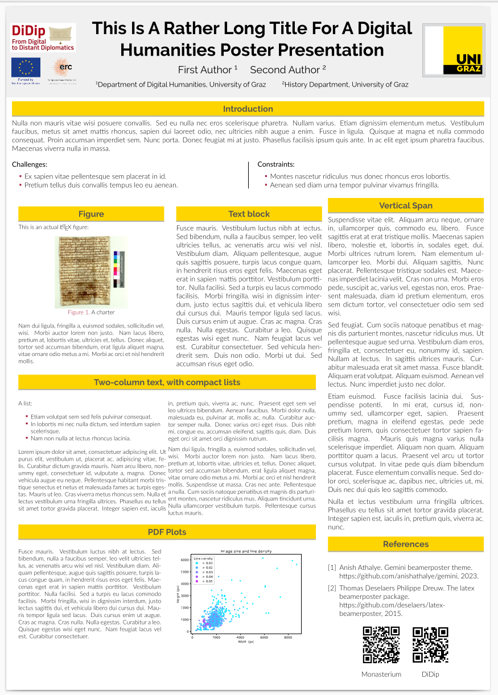

# A template for UniGraz-DH posters

This template is based on the `beamerposter` class written by Philippe Dreuw and Thomas Deselaers, as well as on a slightly modified version of the `Gemini` Beamer theme.


## Philosophy

The class is a derivative of the well-known `beamer` class for presentation slides.
+ The layout is a hierarchy of `block` and `column` elements. Blocks are stacked upon each other; columns line up from left to right.  A column may contain other columns or a stack of blocks.
+ Two stylesheets (`*.sty`) are needed: a beamerposter **theme** and a **color scheme**. The color scheme is pretty self-explanatory; the theme is a bit harder to customize if you are not a bit acquainted with the Beamer package syntax. That is the point: while existing Beamer styles emphasize simplicity and ease of reading, cosmetic bells and whistles are not particularly encouraged and require at least more work from your part.
+ If you already use Beamer for your presentations, recycling slides into a Beamer poster is straightforward.
+ Beamer works particularly well with Tikz, a powerful graphic package for LaTeX.

 $\to$ better choose Beamer if you already use and like Beamer for slides and are happy with the provided stylesheets.


## How to use

In the Linux shell

1. Verify that
   + The `beamer` package is part of your LaTeX setup.
   + You use the **`lualatex`** engine (not `pdflatex`).
   + The beamer Grazmini `*.sty` theme files provided here are in your work directory
2. Run:

```
$ lualatex poster
```

Overleaf:

1. Download this repo as a ZIP file
2. Upload to your Overleaf project





The source for BeamerPoster can be found at:


The `beamerposter` LaTeX package at CTAN:


The Grazmini theme provided here is a modified version of the (MIT-flavored) Gemini theme:


